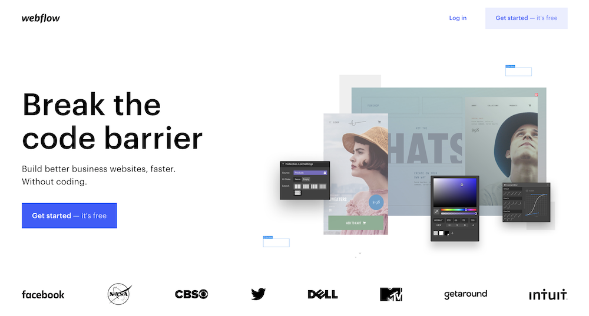
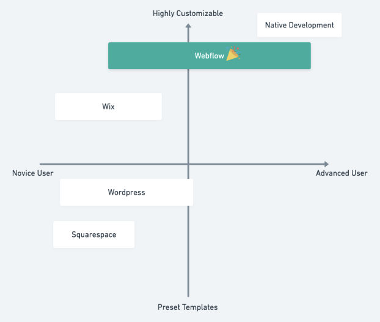
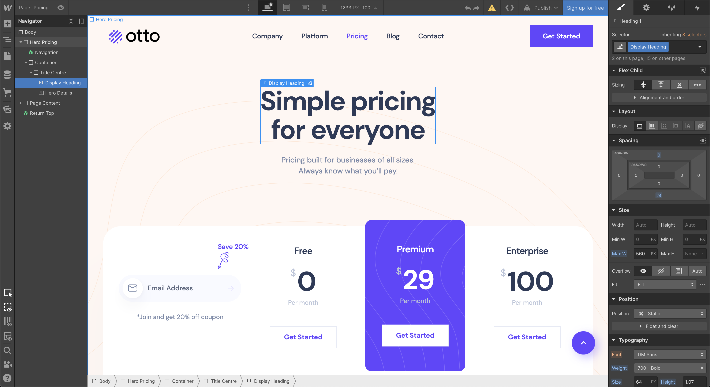
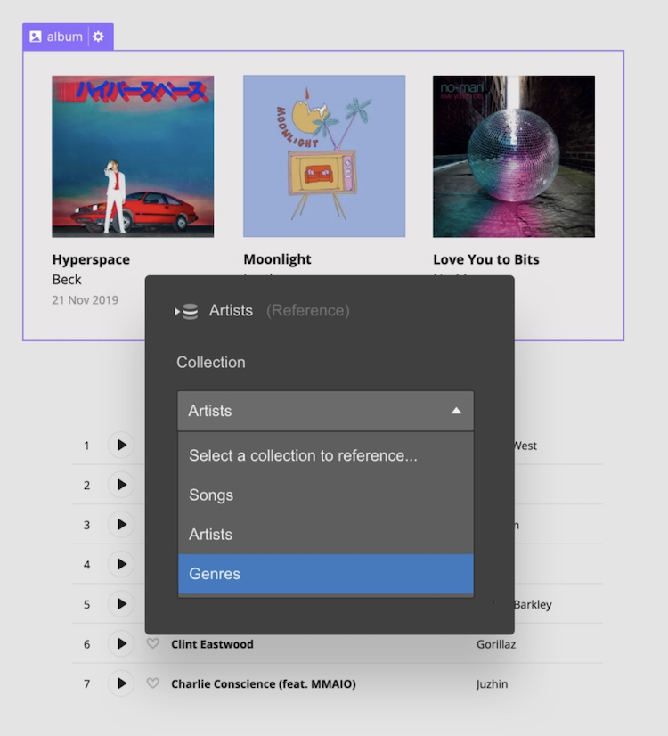
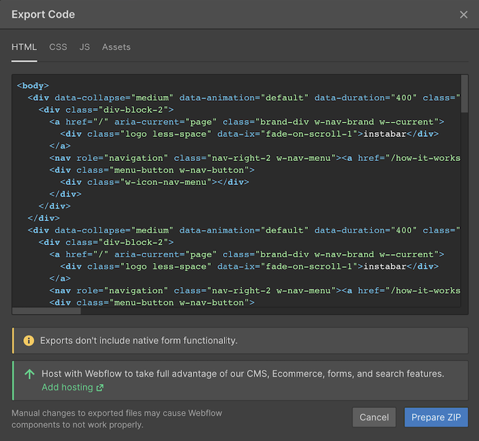
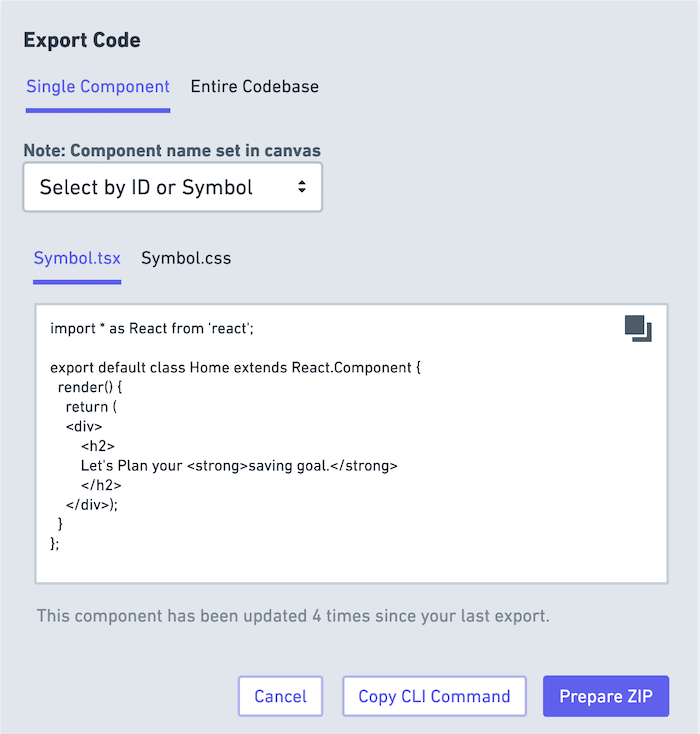

# Webflow: Shaunak Origin Product Take Home #

### Brief
__Webflow__ is a no-code website builder that empowers designers, web developers, and entrepreneurs to build websites with ease. I used the platform in its early days (2016) but abandoned it because the feature set was lackluster and the tool was cumbersome to use. My excitement has been renewed after "re-discovering" the tool recently after looking for a quick way to create a landing page. After using the platform for the past several months, I believe it is __best web site buildng tool on the market.__

As a part of my analysis, I will focus on the [landscape](#landscape), Webflow's [competitive advantage](#comparison), Webflow's [Web Designer](#web-designer) + [CMS Features](#cms), and a [proposed solution](#solution) to a lacking feature.
______
### <a href="#landscape">The Problem + Landscape</a>

When creating a website, one is posed with the choice of developing a site from "scratch" (HTML/CSS/JS) or using a hosted service with pre-built templates (Wordpress, Wix, Squarespace). While the former provides a greater degree of control/customizabilty, it is time/labor intensive and requires technical knowledge to build and maintain. Incumbent hosted services are often reliable and "easy to use" but lack the degree of customizability and control depending on use case.

Webflow bridges these two worlds with a best in class "drag and drop" functionality, granular styling control using CSS formatting and animations, a powerful hosted CMS, and a fleet of available integrations.

| Option    | Native Development                                                      | __Webflow__                                                                                                                                                                                    | Wix                                                                                                                                                                                    | Wordpress                                                                                                                                                                                   | Squarespace                                                                               |
|-----------|-------------------------------------------------------------------------|------------------------------------------------------------------------------------------------------------------------------------------------------------------------------------------------|----------------------------------------------------------------------------------------------------------------------------------------------------------------------------------------|---------------------------------------------------------------------------------------------------------------------------------------------------------------------------------------------|-------------------------------------------------------------------------------------------|
| Pro       | - High customizable - Ensure performance - Custom hosting options | - Highly customizable - Drag-and-drop functionality - Component libraries using CSS - Component Interactions - Integrated CMS - Free and paid templates - Performant Hosting | - Good customizability - Drag-and-drop functionality - Variety of Free Widgets and Apps - Free and paid templates - Integrated blog support - CORVID development system | - Powerful CMS + Blogging features - Basic drag-and-drop functionality - Variety of Free Widget and Apps - Free and paid templates - Supports server-side templating (advanced) | - Beautiful theme templates - Good uptime - Plenty of features - Easy for novice |
| Con       | - Time/labor intensive - Only editable by accessing code             | - Lackluster code export feature - Steep learning curve for beginners                                                                                                                       | - No code export feature - Lacking of advanced customizability options                                                                                                              | - Customizable but requires highly specified skillset (PHP) - Antiquated UI and lacking templates - Management/Hosting Platforms hard to use                                          | - Poor performance - Lack of customizability - Lackluster SEO                       |
| User Type | - Web Developer                                                         | - Web Developer - Technical Designer - Intermediate Digital Content Creator                                                                                                              | - Web Designer - Novice / Intermediate Digital Content Creator - Marketing/Sales Person                                                                                            | - Blogger - Novice/Advanced Users - Web Developer (PHP)                                                                                                                               | - Web Designer - Novice Digital Content Creator - Marketing/Sales Person            |

#### <a href="#comparison">Comparison</a>
To visualize this comparison, we can focus on the skill level of a user vs the available features/customizability offered by each platform. While options like Wordpress or Squarespace would benefit many novice users, Webflow comes out as a clear winner in its ability to market their offering to this same market segment in addition to advanced users & teams (B2B).

_______
### Feature Focus 1: <a href="#web-designer">Webflow Designer</a>
The web tool provided by Webflow allows users to take control of HTML5, CSS3, and JavaScript in a completely visual canvas. The designer cavas (shown below) translates drag and drop HTML elements like (div, containers, images) with advanced CSS modifiers. Additionally, modified elements or grouped elements can be converted to Symbols to support repeatability and consistancy. The platform also supports a "pared-down" Editor view that be used by less technical users to make basid edits to the website (text, images) without modifying an underlying formatting or functionality.

For my analysis of this feature, I'll be focusing on success metrics as it pertains to the entire Designer view in Webflow and the actions a user might take while building a website.

#### KPIs (Success Metrics) :
- __Project Publish Rate__: A key indicator of success for newly onboarded users is whether they "publish" their website to become public facing. __We would want to see this metric increase over time.__ When hypothesising Webflow's customer funnel, it is structured by generating customer interest, driving signups, driving engagement using the Webflow Designer, and finally getting the user to "publish" their website. The reason the publish rate is important because it validates that a user has explored the Webflow Design feature set and has decided to make the site "publicly" accessible. While a publish event is not paid, features like connecting a custom domain, using Webflow's CMS, and removing Webflow branding is contigent on signing up for a paid account. This KPI is a good indicator for qualifying whether a user might convert to a paid tier.

- __# of Symbols/Project__: The symbols functionality is designed to empower users to create reusable components with modifiers available in the Designer Tool. If a particular project implements Symbols (an intermediate implementation feature), it is a good indicator that a user has mastered basic functionality in the tool. __Simply put, an increase in Symbols indicates product mastery of the end user.__ This is incredibly important for a tool thats primary value proposition is providing builders advanced functionality in an easy-to-use format.

- __Average Active Session Time Per Publish Event__: A hallmark of the Designer is the ability the tool gives a user to take an idea and make it real, quickly. By measuring the amount of "active" time or time a user spends modifying a project before publishing is a good indicator of the tools ability to aid in the users build/deploy lifecycle. __A decrease in this metric would correlate positively with how well the Designer is helping users ship.__

___
### Feature Focus 2: <a href="#cms">CMS</a>
Webflow CMS touts itself as “the world’s first visual content management system,” allowing designers to define the structure and style of their dynamic content without messing with plugins, PHP, or managed databases. Prior to Webflow, users wanting to implement a managed CMS were bound to Wordpress being the their only option. Users are often locked into their theme’s default templates and styles. And so, customizing individual elements like post fields requires either adding third-party plugins or manually rewriting the underlying template files.

Webflow CMS content can be hand-created, imported from a .CSV file, or added through Webflow’s CMS API. Users can then create Collections, or reusable templates for dynamic content types. For example, a website can feature collections of blog posts, authors, clients, projects, products, categories, and so on. Webflow CMS is akin to having all of the upsides of using a database without the need to manage it.

#### KPIs (Success Metrics):

NOTE: Because this feature is primarily a backend service, I will focus on engagement metrics that will help me us determine product success.

- __Average # of POST requests per collection__: A key performance indicator for the CMS feature is the average number of POST requests per collection. The access to the CMS functionality requires an upgraded membership plan which allows the storing of data + access to the CMS API. A direct way to measure the CMS feature would be to explore how often a collection database is being modified. This indicates how often users are interacting with the service (creating, updating, deleting data) and how often CMS information is being accessed by the client (website). __We would expect this metric to increase over time.__

- __# of records in CMS per project__: By measuring the number of records in a CMS, a product team would quickly segment users by usage of the service to potentially market additional functionality to manage larger CMS offerings. Currently, Webflow CMS offers a CMS Plan (12 dollars/month for 2000 CMS items) and a Business Plan (36 dollars/month for 10,000 CMS items). By tracking the # of records, it opens the opportunity to drive active users at the CMS Plan level to upgrade to the Business Plan tier. __We would expect this metric to increase over time.__
<!--  
- __# of CMS bug tickets__: Another metric of product success is measuring a decreasing number of CMS related bugs month over month. -->
____________
### Product Improvement: <a href="#solution">Codebase Export Feature</a>
__Problem__: Webflow advertises that it translates web designs into clean, semantic code that’s ready to publish to the web or hand off to developers. While its internal hosting functionality is known to be quite performant, __the ability of using its exported code is lacking.__ Modern web app architecture patterns value small/modular components that capture functional and visual UI elements. Upon export, the provided code is messy, not organized or modular.

__Who__: This problem primarily impacts users who are looking to export their Webflow site in raw HTML, CSS, and JS to edit via a code editor or host in an existing cloud stack. These users are most likely using Webflow to prototype ideas or integrate into their design/build workflows for their own software products.

__Why is this important to solve?__: Nowdays, most development teams use modern web application frameworks like React or Angular to ship products. If a designer or developer can prototype a feature in Webflow and easily pull this into a codebase, this would elimanate a multitude of roadblocks and difficulties present in the software development process (ie. developer not implementing designs correctly, designers not having to spend added time on documentation, building animations, etc.)

__User Problems__: 
- As a developer, I can't access Webflow files/changes programmatically. I can only access these changes by manually exporting the entire codebase in the form of a zip file.
- As a developer, I have no way to export a single UI element.
- As a developer, I need to spend time modifying the exported code to be usable as a React or Angular component.

Research:
- https://forum.webflow.com/t/webflow-competitor-exporting-production-ready-react-components/70343
- https://webflow.com/blog/react-components-in-webflow
- https://forum.webflow.com/t/webflow-vs-framer-x/67895/4
- https://forum.webflow.com/t/best-practices-on-converting-a-webflow-app-to-react/43110

####Proposed Feature Epic: Allow users to export production-ready React components.

__NOTE__: Since I have access to 2 months with 1 designer and 2 engineers, I would like to tackle more than one feature improvement which is why I identified several feature improvements that align with the epic above.

__Features__: 
- Users will be able to identify an exportable piece of the Webflow project via an "id" or "Symbol name".
- Users will be able to export a Webflow element as a React component.
- Users will be able to access a change log for a particular component from previous export event.
- Stretch: Users will be able to access currently code export functionality via a CLI tool

##### KPIs to measure success:
- __# of component export events vs entire codebase export events__: We can assume that users who are export code are doing so to host or modify the exported code for added functionality. These users are technical. If these users are using the Export React Component feature more than the Entire Codebase Export feature, we can build confidence around its inherent value to developers. __We would expect this metric to increase over time.__

#### Wireframe: (Built using Whimsical)

##### What will be the effect?: 

Currently, there is no other tool in the market that offers functionality that provides a robust method to create software visually and integrate this into a codebase. By implementing this feature, we could expect many more enterprise/startup software clients to use Webflow as it can directly integrate into their development workflow. This solution would provide a revolutionary leap in the progression of the industry to blend design/development work flows (see. Adobe Muse, Draftbit, Framer, Zeplin, etc)

<!-- #### Problem Focus 2: User Login & Access Management Not Available
Many websites have the need to capture user information via a Sign Up functionality and surface information specifically to that user. Currently, Webflow does not support this functionality though you can integrate third party tools like Google Firebase to manage user signup + login. The Webflow community forum indicates 5226 upvotes over the past 3 years to addition of this functionality. -->

